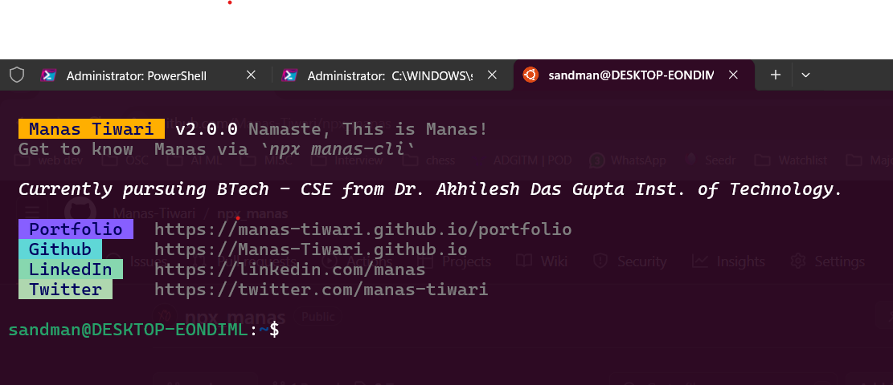

# `npx npx_manas`

- Get to know Manas Tiwari using your command line with Node.js

## Snapshot


## Usage

To use this CLI run the following command:

```sh
npx npx_manas
```

## Development

To develop this CLI locally, make sure you `npm link` it.

```sh
# Open the CLI root directory and run.
npm link

# This will link the CLI binary `manas` so that you can execute it.
```
